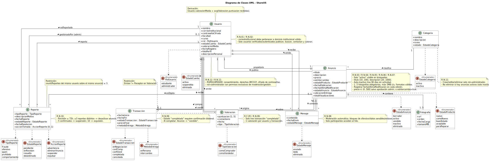
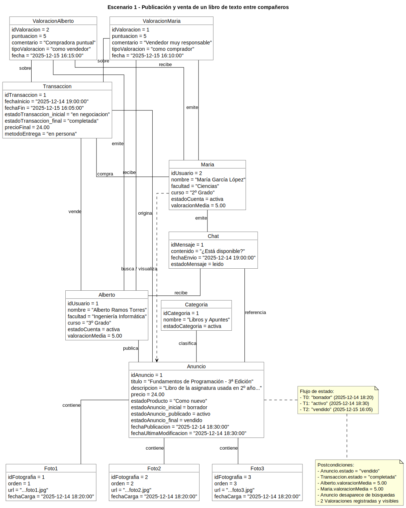
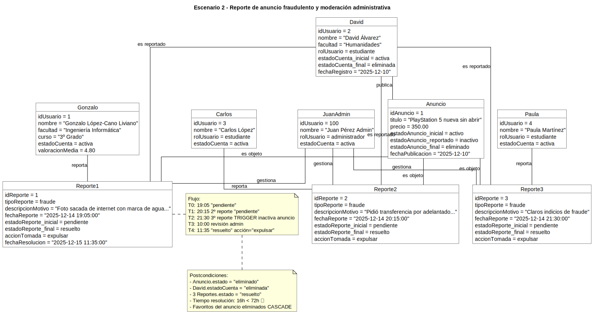
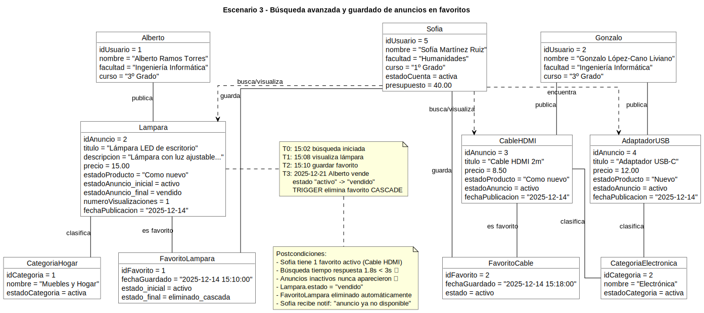
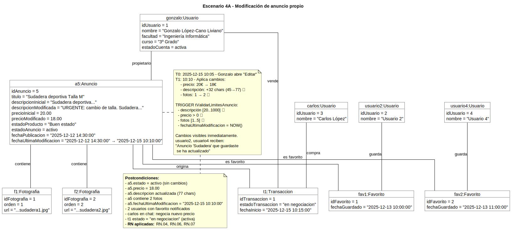
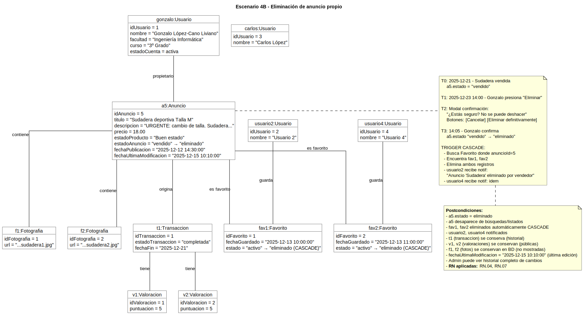
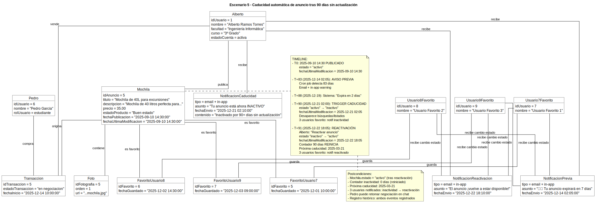
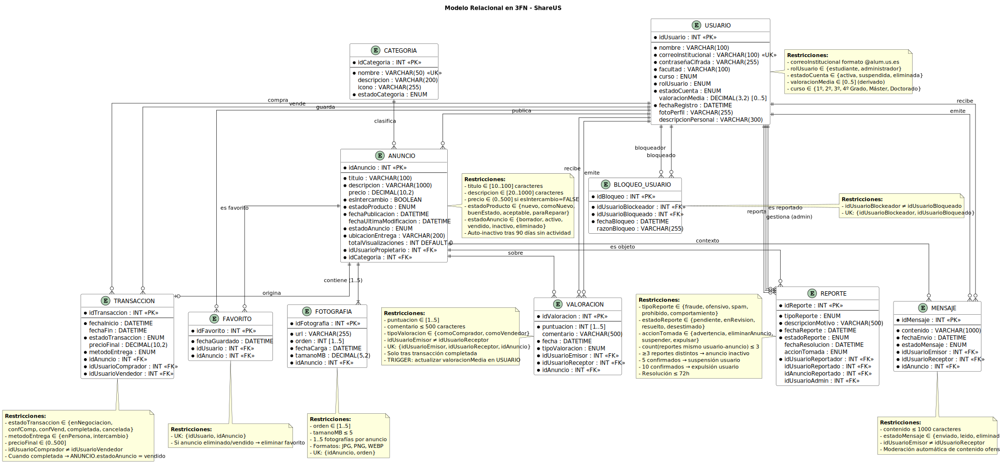

# SHAREUS

## Miembros del grupo L7-5 

1. Ramos Torres, Alberto
1. López-Cano Liviano, Gonzalo

## Índice
### Índice

- [Título Proyecto](#título-proyecto)
- [Miembros del grupo L7-5](#miembros-del-grupo-l7-5)
- [1. Introducción al problema](#1-introducción-al-problema)
- [2. Glosario de términos](#2-glosario-de-términos)
- [3. Visión general del sistema](#3-visión-general-del-sistema)
  - [3.1. Requisitos generales](#31-requisitos-generales)
  - [3.2. Usuarios del sistema](#32-usuarios-del-sistema)
- [4. Catálogo de requisitos](#4-catálogo-de-requisitos)
  - [4.1 Requisitos funcionales](#41-requisitos-funcionales)
    - [R.F.01. Publicar anuncio](#rf01-publicar-anuncio)
    - [R.F.02. Buscar productos con filtros](#rf02-buscar-productos-con-filtros)
    - [R.F.03. Contactar con vendedor](#rf03-contactar-con-vendedor)
    - [R.F.04. Guardar anuncios en favoritos](#rf04-guardar-anuncios-en-favoritos)
    - [R.F.05. Valorar transacción](#rf05-valorar-transacción)
    - [R.F.06. Modificar o eliminar anuncio propio](#rf06-modificar-o-eliminar-anuncio-propio)
    - [R.F.07. Reportar anuncio o usuario](#rf07-reportar-anuncio-o-usuario)
    - [R.F.08. Consultar listado de anuncios activos](#rf08-consultar-listado-de-anuncios-activos)
    - [R.F.09. Consultar historial de transacciones](#rf09-consultar-historial-de-transacciones)
    - [R.F.10. Administrar categorías](#rf10-administrar-categorías)
  - [4.1.1. Requisitos de información](#411-requisitos-de-información)
    - [R.I.01. Información de usuario](#ri01-información-de-usuario)
    - [R.I.02. Información de anuncio](#ri02-información-de-anuncio)
    - [R.I.03. Información de fotografías de anuncios](#ri03-información-de-fotografías-de-anuncios)
    - [R.I.04. Información de categorías](#ri04-información-de-categorías)
    - [R.I.05. Información de mensajes](#ri05-información-de-mensajes)
    - [R.I.06. Información de valoraciones](#ri06-información-de-valoraciones)
    - [R.I.07. Información de transacciones](#ri07-información-de-transacciones)
    - [R.I.08. Información de reportes](#ri08-información-de-reportes)
  - [4.1.2. Reglas de negocio](#412-reglas-de-negocio)
    - [R.N.01. Verificación mediante correo institucional](#rn01-verificación-mediante-correo-institucional)
    - [R.N.02. Acceso exclusivo a usuarios autenticados](#rn02-acceso-exclusivo-a-usuarios-autenticados)
    - [R.N.03. Visibilidad de anuncios](#rn03-visibilidad-de-anuncios)
    - [R.N.04. Límites de caracteres](#rn04-límites-de-caracteres)
    - [R.N.05. Caducidad automática de anuncios](#rn05-caducidad-automática-de-anuncios)
    - [R.N.06. Fotografía obligatoria](#rn06-fotografía-obligatoria)
    - [R.N.07. Confirmación bilateral de transacciones](#rn07-confirmación-bilateral-de-transacciones)
    - [R.N.08. Gestión administrativa de reportes](#rn08-gestión-administrativa-de-reportes)
    - [R.N.09. Permisos exclusivos de administración](#rn09-permisos-exclusivos-de-administración)
    - [R.N.10. Protección de datos personales](#rn10-protección-de-datos-personales)
    - [R.N.11. Productos prohibidos](#rn11-productos-prohibidos)
  - [4.2. Mapa de historias de usuario (opcional)](#42-mapa-de-historias-de-usuario-opcional)
  - [4.3. Requisitos no funcionales (opcional)](#43-requisitos-no-funcionales-opcional)
    - [R.N.F. 01. Rendimiento](#rnf-01-rendimiento)
    - [R.N.F. 02. Disponibilidad](#rnf-02-disponibilidad)
    - [R.N.F. 03. Seguridad](#rnf-03-seguridad)
    - [R.N.F. 04. Usabilidad](#rnf-04-usabilidad)
    - [R.N.F. 05. Compatibilidad](#rnf-05-compatibilidad)
    - [R.N.F. 06. Escalabilidad](#rnf-06-escalabilidad)
    - [R.N.F. 07. Mantenibilidad](#rnf-07-mantenibilidad)
    - [R.N.F. 08. Cumplimiento normativo](#rnf-08-cumplimiento-normativo)
- [5. Modelo conceptual](#5-modelo-conceptual)
  - [5.1. Diagramas de clases UML](#51-diagramas-de-clases-uml)
  - [5.2. Escenarios de prueba](#52-escenarios-de-prueba)
    - [Escenario 1: Publicación y venta de un artículo](#escenario-1-publicación-y-venta-de-un-artículo)
    - [Escenario 2: Reporte y moderación de anuncio](#escenario-2-reporte-y-moderación-de-anuncio)
    - [Escenario 3: Búsqueda avanzada y favoritos](#escenario-3-búsqueda-avanzada-y-favoritos)
    - [Escenario 4: Modificación o eliminación de anuncio propio](#escenario-4-modificación-o-eliminación-de-anuncio-propio)
    - [Escenario 5: Caducidad automática del anuncio (90 días sin actividad)](#escenario-5-caducidad-automática-del-anuncio-90-días-sin-actividad)
- [6. Matrices de trazabilidad](#6-matrices-de-trazabilidad)
- [7. Modelo relacional en 3FN](#7-modelo-relacional-en-3fn)
  - [7.1. Transformación de jerarquías](#71-transformación-de-jerarquías)
- [8. Matriz de trazabilidad MC/SQL (opcional)](#8-matriz-de-trazabilidad-mcsql-opcional)

## 1. Introducción al problema

- En el entorno universitario español, los estudiantes enfrentan necesidades recurrentes de
adquirir materiales académicos (libros de texto, apuntes, calculadoras científicas, material de
laboratorio) y objetos de uso cotidiano (muebles, electrodomésticos, decoración, equipos
deportivos, ropa) a precios asequibles. Muchos estudiantes acumulan artículos
en buen estado que ya no utilizan y desean vender o intercambiar para recuperar parte de su
inversión o liberar espacio en sus residencias

- Clientes y usuarios: Los usuarios principales de shareUS son estudiantes universitarios activos,
verificados mediante correo electrónico institucional (xxxxx@alum.us.es en el caso de sevilla). Este
sistema asegura un entorno exclusivo, seguro y orientado específicamente a las necesidades
estudiantiles.

- Situación actual: Actualmente, los estudiantes recurren principalmente a plataformas
generalistas como Wallapop, Vinted o grupos de Facebook para estas transacciones. Si bien
estas herramientas son funcionales, presentan limitaciones importantes en el contexto
universitario:
    - Alcance geográfico excesivamente amplio: dificulta encontrar productos disponibles en el
    propio campus o ciudad universitaria
    - Ausencia de filtros académicos: no es posible buscar por curso, facultad o necesidades
        académicas específicas
    - Comunicación dispersa: la cordinación y entregas se realizan fuera del campus universitario y dificultan la entrega siendo menos accesible para muchos estudiantes

- Problemas identificados:
    - Inversión económica elevada en materiales que se utilizan durante un solo curso académico
    - Dificultad para localizar compradores/vendedores dentro del mismo entorno universitario
    - Desconfianza en transacciones con desconocidos sin respaldo institucional
    - Impacto ambiental negativo por desecho de objetos en buen estado

- Expectativas del proyecto: shareUS pretende convertirse en el marketplace de referencia para
comunidades universitarias españolas, facilitando:
    - Compraventa segura y verificada entre estudiantes de la misma institución
    - Reducción del gasto estudiantil mediante economía circular
    - Fomento de la sostenibilidad y reutilización de recursos
    - Creación de comunidad e interacción entre estudiantes
    - Sistema de valoraciones que genere confianza entre usuarios
    - Filtrado inteligente por facultad, curso académico y categorías específicas estudiantiles

## 2. Glosario de términos

- Anuncio: Publicación visible en el portal dirigida a otros estudiantes de la Universidad de Sevilla con opción de añadir fotos, descripción, precio y ubicación para facilitar el contacto

- Artículo/Producto: Bien material ofrecido para venta o intercambio en la plataforma (libros,
apuntes, material académico, tecnología, muebles, ropa, etc.).

- Categoría: Clasificación temática de los productos (Libros y Apuntes, Tecnología, Muebles y
Hogar, Ropa y Complementos, Deportes, Electrónica, Servicios).

- Chat interno: Sistema de mensajería integrado en la plataforma que permite la comunicación
privada entre comprador y vendedor.

- Comprador: Usuario registrado que busca adquirir artículos publicados por otros estudiantes.

- Curso académico: Nivel de estudios del estudiante (1º Grado, 2º Grado, Máster, Doctorado)
que puede condicionar la visibilidad de ciertos productos académicos específicos.

- Estado del producto: Clasificación del grado de conservación de un artículo (Nuevo, Como
nuevo, Buen estado, Estado aceptable, Para reparar).

- Facultad/Centro: División organizativa de la universidad que permite segmentar productos por
áreas de conocimiento (Ingeniería, Ciencias, Humanidades, Derecho, etc.).

- Favoritos: Lista personalizada donde los usuarios guardan anuncios de interés para consultarlos
posteriormente.

- Marketplace: Plataforma digital que conecta vendedores y compradores sin gestionar
directamente el inventario ni las transacciones.

- Moderador/Administrador: Usuario con permisos especiales para supervisar contenidos,
validar anuncios, gestionar reportes y administrar la comunidad. Diferencias de permisos entre roles.

- Perfil de usuario: Página personalizada que contiene información del estudiante (nombre,
facultad, curso, valoración media, anuncios activos, historial).

- Publicación: Acción de crear y activar un anuncio para que sea visible públicamente en la
plataforma.

- Reporte: Funcionalidad que permite a los usuarios denunciar anuncios fraudulentos, contenido
inapropiado o comportamientos inadecuados.

- Transacción: Operación completa de compraventa o intercambio entre dos usuarios, desde el
contacto inicial hasta la entrega del producto.

- Usuario verificado: Estudiante que ha completado el proceso de autenticación mediante correo
electrónico asociado, garantizando su pertenencia a la comunidad universitaria. 

- Valoración/Reseña: Sistema de puntuación (1-5 estrellas) y comentarios que permite a
compradores y vendedores evaluar la experiencia de transacción, generando reputación.

- Vendedor: Usuario registrado que publica anuncios ofreciendo artículos propios para venta o
intercambio.

- Visibilidad de anuncio: Parámetro que determina qué usuarios pueden ver una publicación
según filtros de facultad, curso o categoría.

- Bloquear Usuario: Acción para restringir la interacción o visualización de anuncios por parte de otro usuario, generalmente en casos de comportamientos inadecuados.

## 3. Visión general del sistema
- ShareUS es una plataforma web diseñada específicamente para facilitar el intercambio y la
compraventa de artículos entre estudiantes de la Universidad de Sevilla. A diferencia de las
plataformas comerciales generalistas, shareUS se centra en crear un entorno de confianza,
cerrado y verificado, donde los estudiantes puedan realizar transacciones de manera segura y
eficiente dentro del campus universitario.

- El sistema busca optimizar la reutilización de materiales académicos y objetos de uso cotidiano,
reduciendo costes para los estudiantes y fomentando prácticas sostenibles dentro de la
comunidad universitaria.
### 3.1. Requisitos generales
(reducir gestion...)

- <strong>R.G.01. Base de datos relacional MariaDB</strong>  

  Toda la información del sistema (usuarios, anuncios, transacciones, mensajes, valoraciones) debe almacenarse en una base de datos relacional MariaDB, garantizando integridad referencial y la consistencia de datos.

- <strong>R.G.02. Autenticación mediante correo institucional</strong> 

  El acceso a la plataforma requiere registro obligatorio mediante correo electrónico institucional de la Universidad de Sevilla (formato: <em>xxxxx@alum.us.es</em>).  
  El sistema debe enviar un correo de verificación con enlace de activación que caduca en 24 horas, asegurando que solo estudiantes activos puedan utilizar la plataforma.

  Los usuarios deben poder crear, editar, activar, desactivar y eliminar sus propios anuncios.  
  Cada anuncio debe incluir título, descripción, precio, estado del producto, categoría, fotografías y ubicación de entrega dentro del campus.

- <strong>R.G.03. Sistema de búsqueda y filtrado avanzado</strong>  

  La plataforma debe incluir un motor de búsqueda que permita filtrar anuncios por categoría, facultad, curso académico, rango de precios, estado del producto y palabras clave en título o descripción.

- <strong>R.G.04. Sistema de mensajería interna</strong>

  El sistema debe proporcionar un chat privado entre comprador y vendedor, integrado en la plataforma, que permita coordinar detalles de la transacción sin exponer datos personales externos (teléfono o correo personal).

  El tratamiento de información personal debe cumplir con el RGPD y la LOPDGDD, garantizando consentimiento informado, cifrado de contraseñas y los derechos de acceso, rectificación y supresión de datos.

- <strong>R.G.05. Sistema de reputación mediante valoraciones</strong>

  Compradores y vendedores deben poder valorarse mutuamente tras completar una transacción, generando un historial público de reputación que fomente la confianza entre usuarios.

- <strong>R.G.06. Moderación y gestión administrativa</strong>  

  Los administradores deben contar con herramientas para revisar reportes, validar o eliminar anuncios inapropiados, suspender cuentas infractoras y gestionar las categorías del sistema.

- <strong>R.G.07. Seguridad y rendimiento</strong>  

  El sistema debe mantener tiempos de respuesta inferiores  
  a 3 segundos para operaciones habituales (búsquedas,  
  carga de anuncios, envío de mensajes) y garantizar una  
  disponibilidad del 99% durante el horario académico.

### 3.2. Usuarios del sistema 
- <strong>Estudiante registrado (Usuario estándar)</strong>

    Estudiante activo de la Universidad de Sevilla que ha completado el proceso de verificación
    mediante correo institucional.

     <strong>Funcionalidades disponibles:</strong> 
    - Crear, modificar y eliminar sus propios anuncios
    - Buscar anuncios utilizando filtros avanzados
    - Contactar con vendedores mediante chat interno
    - Guardar anuncios en lista de favoritos
    - Marcar transacciones como completadas
    - Valorar a otros usuarios tras completar transacciones
    - Gestionar su perfil personal (foto, descripción, facultad, curso)
    - Reportar anuncios o usuarios con comportamientos inadecuados
    - Consultar su historial de transacciones
    - Bloquear usuarios para evitar interacciones no deseadas

- <strong>Administrador/Moderador</strong>

     Usuario con permisos elevados responsable de supervisar el correcto funcionamiento de la
    plataforma y garantizar el cumplimiento de las normas de la comunidad.
    <strong>Funcionalidades disponibles:</strong>

    - Todas las funcionalidades del usuario estándar
    - Revisar y gestionar reportes de usuarios
    - Validar, desactivar o eliminar anuncios que incumplan las normas
    - Suspender temporalmente o eliminar cuentas de usuarios infractores
    - Crear, modificar o eliminar categorías del sistema
    - Acceder a estadísticas globales de uso (número de usuarios activos, anuncios publicados,transacciones completadas)
    - Visualizar historial completo de modificaciones de anuncios
    - Eliminar mensajes de chat con contenido inapropiado
- <strong>Usuario no registrado (Visitante)</strong>  

    Usuario con permisos elevados responsable de supervisar el correcto funcionamiento de la
    plataforma y garantizar el cumplimiento de las normas de la comunidad.

    <strong>Funcionalidades disponibles:</strong>
    - Solo puede visualizar la página de inicio informativa del proyecto
    - Acceder al formulario de registro
    - Consultar términos y condiciones de uso
    - <strong>No puede:</strong> ver anuncios, realizar búsquedas, contactar usuarios ni publicar productos
    
## 4. Catálogo de requisitos

### 4.1 Requisitos funcionales

#### R.F.01. Publicar anuncio

Como estudiante vendedor
quiero crear un anuncio con información detallada de un producto
para ofrecerlo a otros estudiantes de mi universidad

**Prueba de aceptación**
- El sistema debe solicitar obligatoriamente: título, descripción, categoría, precio, estado del producto, ubicación de entrega y al menos una fotografía  
- El anuncio debe quedar en estado "borrador" hasta que el usuario lo active manualmente
- Se debe permitir subir entre 1 y 5 fotografías en formato JPG, PNG o WEBP, máximo 5 MB cada una
- La fecha de publicación se registra automáticamente al activar el anuncio
- Se debe aplicar R.N.01 (usuario verificado), R.N.04 (límites de caracteres) y R.N.06 (fotografía obligatoria)

#### R.F.02 Buscar productos con filtros
Como estudiante comprador
quiero buscar productos aplicando filtros específicos
para encontrar rápidamente artículos que necesito dentro del campus

**Prueba de aceptación**
- El sistema debe permitir filtrar simultáneamente por: categoría, facultad del vendedor, curso
académico, rango de precios y estado del producto
- Debe existir campo de búsqueda de texto libre que consulte en título y descripción
- Los resultados deben ordenarse por relevancia, fecha de publicación (más recientes
primero) o precio (ascendente/descendente)
- Solo se muestran anuncios en estado "activo" y no reportados
- Se debe aplicar R.N.02 (solo usuarios autenticados) y R.N.03 (visibilidad de anuncios
activos)
#### R.F.03. Contactar con vendedor
Como estudiante comprador
quiero enviar mensajes privados al vendedor de un anuncio
para negociar detalles de precio, estado y coordinar entrega en el campus

**Prueba de aceptación**
- El chat debe abrirse desde la ficha detallada del anuncio mediante botón "Contactar"
- Los mensajes se almacenan con marca temporal y aparecen ordenados cronológicamente
- El vendedor recibe notificación visual de nuevos mensajes no leídos
- No se exponen datos personales directos (teléfono, email personal) hasta que los usuarios decidan compartirlos voluntariamente
- Se debe aplicar R.N.02 (usuario autenticado) y R.N.08 (moderación de contenido
inapropiado)
#### R.F.04. Guardar anuncios en favoritos

Como estudiante usuario
quiero marcar anuncios de interés en una lista de favoritos
para consultarlos posteriormente sin necesidad de volver a buscarlos
**Prueba de aceptación**
- Desde la ficha del anuncio debe existir icono/botón "Añadir a favoritos"
- Los favoritos se visualizan en sección personal del perfil del usuario
- Si el anuncio se elimina o cambia a estado "vendido", desaparece automáticamente de
favoritos
- El usuario puede eliminar anuncios de su lista en cualquier momento
- Se debe aplicar R.N.02 (usuario autenticado)
#### R.F.05. Valorar transacción
Como estudiante comprador o vendedor
quiero puntuar y comentar sobre la experiencia de una transacción
para generar reputación pública que ayude a otros usuarios a tomar decisiones informadas

**Pruebas de aceptación:**
- Solo se puede valorar después de marcar la transacción como "completada" por ambas
partes
- La valoración incluye puntuación obligatoria (1-5 estrellas) y comentario opcional (máximo
500 caracteres)
- Cada usuario solo puede valorar una vez por transacción
- Las valoraciones aparecen públicamente en el perfil del usuario valorado
- La valoración media se recalcula automáticamente tras cada nueva valoración
- Se debe aplicar R.N.09 (confirmación bilateral) y R.N.08 (moderación de comentarios
ofensivos)

#### R.F.06. Modificar o eliminar anuncio propio
Como estudiante vendedor
quiero editar la información de mis anuncios o eliminarlos
para actualizar datos, corregir errores o retirar productos ya vendidos
**Pruebas de aceptación:**
- Solo el propietario del anuncio puede modificarlo o eliminarlo
- Al eliminar, el sistema solicita confirmación mediante ventana modal
- Los anuncios eliminados no aparecen en búsquedas ni en favoritos de otros usuarios
- Se registra la fecha de última modificación visible públicamente
- Se debe aplicar R.N.05 (anuncios inactivos tras 90 días sin actividad) y R.N.07 (trazabilidad
de cambios)

#### R.F.07. Reportar anuncio o usuario
Como estudiante usuario
quiero denunciar anuncios fraudulentos o comportamientos inadecuados
para contribuir a mantener la seguridad y calidad de la plataforma

**Pruebas de aceptación:**
- Existe botón "Reportar" visible en cada anuncio y perfil de usuario
- El reporte incluye motivo seleccionable: contenido ofensivo, fraude, spam, producto
prohibido, comportamiento inadecuado
- El sistema genera notificación automática al administrador
- Un usuario no puede reportar más de 3 veces el mismo anuncio
- Los anuncios con 3 o más reportes de diferentes usuarios se desactivan automáticamente
hasta revisión
- Se debe aplicar R.N.10 (revisión administrativa en 72 horas)

#### R.F.08. Consultar listado de anuncios activos
Como estudiante usuario
quiero explorar todos los anuncios publicados recientemente
para descubrir oportunidades de compra o intercambio que no había buscado activamente

**Pruebas de aceptación:**
- El listado muestra anuncios ordenados por fecha de publicación (más recientes primero) por
defecto
- Cada elemento incluye: imagen principal, título, precio, facultad del vendedor y fecha de
publicación
- Se implementa paginación mostrando 20 anuncios por página
- Existe opción para cambiar vista entre cuadrícula (grid) y lista vertical
- Se debe aplicar R.N.02 (usuarios verificados) y R.N.03 (solo anuncios activos aprobados)
#### R.F.09. Consultar historial de transacciones
Como estudiante usuario
quiero revisar mi historial de compras y ventas
para llevar control de transacciones realizadas y consultar detalles pasados

**Pruebas de aceptación:**
- El historial se divide en dos pestañas: "Como vendedor" y "Como comprador"
- Cada registro muestra: producto, usuario involucrado, fecha, precio final y estado
(completada/cancelada)
- Permite filtrar por rango de fechas y estado
- Solo el usuario propietario puede acceder a su propio historial (información privada)
- Se debe aplicar R.N.09 (confirmación bilateral para transacciones completadas)

#### R.F.10. Administrar categorías
Como administrador
quiero crear, modificar o eliminar categorías de productos
para mantener organizada la clasificación de anuncios según evolucionen las necesidades

**Pruebas de aceptación:**
- El panel de administración lista todas las categorías existentes con contador de anuncios
asociados
- Al crear categoría, se solicita nombre, descripción breve e icono representativo
- No se permite eliminar categorías con anuncios activos asociados (solo desactivarlas)
- Los cambios se reflejan inmediatamente en la plataforma
- Se debe aplicar R.N.11 (solo administradores tienen acceso)

#### 4.1.1. Requisitos de información

##### R.I.01. Información de usuario

**Como** sistema

**quiero** almacenar datos completos de cada estudiante registrado

**para** gestionar autenticación, perfiles, transacciones y reputación

**Datos a almacenar:**
- Nombre completo
- Correo electrónico institucional (único, formato: - xxxxx@alum.us.es Ejemplo de la universidad de sevilla, depederá de la universidad)
- Contraseña cifrada (algoritmo bcrypt o Argon2)
- Facultad/Centro de pertenencia
- Curso académico actual (1º, 2º, 3º, 4º Grado, Máster, - Doctorado)
- Fotografía de perfil (opcional, URL)
- Descripción personal breve (opcional, máximo 300 - caracteres)
- Fecha de registro
- Estado de cuenta (activa, suspendida, eliminada)
- Valoración media recibida (calculada automáticamente)
- Número total de transacciones completadas
- Rol (estudiante, administrador)

**Pruebas de aceptación:**
- El correo debe validarse con formato @alum.us.es (Dependiedno de la universidad. Ejemplo de universidad de Sevilla)
- La contraseña debe cifrarse antes del almacenamiento
- No pueden existir dos usuarios con el mismo correo - electrónico (clave única)
- La valoración media se recalcula automáticamente tras cada nueva valoración recibida

##### R.I.02. Información de anuncio

**Como** sistema

**quiero** registrar datos completos de cada anuncio

**para** facilitar búsquedas, gestión, trazabilidad y 
moderación

**Datos a almacenar:**
- Título del anuncio (10-100 caracteres)
- Descripción detallada (20-1000 caracteres)
- Precio en euros (número decimal positivo < 500€) o - indicador "intercambio"
- Estado del producto (nuevo, como nuevo, buen estado, - aceptable, para reparar)
- Categoría (referencia a tabla Categorías)
- Facultad del vendedor (referencia automática desde perfil de usuario)
- Usuario propietario (referencia a tabla Usuarios)
- Fecha y hora de publicación
- Fecha de última modificación
- Estado del anuncio (borrador, activo, vendido, inactivo, - eliminado)
- Número de visualizaciones (contador)
- Ubicación de entrega (campus, residencia, facultad específica)

**Pruebas de aceptación:**
- El título debe tener entre 10 y 100 caracteres (R.N.04)
- La descripción debe tener entre 20 y 1000 caracteres (R.N. 04)
- El precio debe ser decimal positivo o indicar modalidad - intercambio
- Los anuncios sin actividad durante 90 días pasan automáticamente a "inactivo" (R.N.05)

##### R.I.03. Información de fotografías de anuncios

**Como** sistema

**quiero** asociar múltiples imágenes a cada anuncio

**para** mejorar la presentación visual y generar confianza en los compradores

**Datos a almacenar:**
- Referencia al anuncio propietario (clave foránea)
- URL de almacenamiento de la imagen
- Orden de visualización (principal, secundaria, - terciaria...)
- Fecha de carga
- Tamaño del archivo en MB

**Pruebas de aceptación:**
- Cada anuncio debe tener mínimo 1 fotografía y máximo 5 (R.N.06)
- Formatos permitidos: JPG, PNG, WEBP
- Tamaño máximo por imagen: 5 MB
- La primera imagen cargada se establece automáticamente - como principal

##### R.I.04. Información de categorías

**Como** sistema

**quiero** mantener catálogo de categorías predefinidas

**para** clasificar anuncios y facilitar búsquedas segmentadas

**Datos a almacenar:**
- Nombre de categoría (único)
- Descripción breve
- Icono representativo (URL)
- Estado (activa, inactiva)

**Pruebas de aceptación:**
- No pueden existir dos categorías con el mismo nombre
- Solo administradores pueden crear o modificar categorías  (R.N.11)
- Ejemplos predefinidos: Libros y Apuntes, Tecnología, - Muebles y Hogar, Ropa, Deportes,
- Electrónica, Servicios

##### R.I.05. Información de mensajes

**Como** sistema

**quiero** registrar conversaciones entre comprador y vendedor

**para** mantener historial de comunicaciones y facilitar moderación

**Datos a almacenar:**
- Referencia al anuncio relacionado
- Usuario emisor (referencia)
- Usuario receptor (referencia)
- Contenido del mensaje (texto, máximo 1000 caracteres)
- Fecha y hora de envío
- Estado (enviado, leído, eliminado)

**Pruebas de aceptación:**
- Los mensajes se ordenan cronológicamente en la conversación
- Solo participantes del chat pueden acceder a los mensajes
- Los mensajes con contenido ofensivo pueden ser eliminados por moderadores (R.N.08)
- El receptor recibe notificación de nuevos mensajes

##### R.I.06. Información de valoraciones

**Como** sistema

**quiero** almacenar valoraciones entre usuarios

**para** construir sistema de reputación y generar confianza en la comunidad

**Datos a almacenar:**
- Usuario que emite valoración (referencia)
- Usuario que recibe valoración (referencia)
- Anuncio relacionado con la transacción (referencia)
- Puntuación (entero 1-5 estrellas)
- Comentario textual (opcional, máximo 500 caracteres)
- Fecha de valoración
- Tipo (como comprador / como vendedor)

**Pruebas de aceptación:**
- Solo se puede valorar tras confirmar transacción - completada (R.N.09)
- Un usuario no puede valorarse a sí mismo
- Solo se permite una valoración por usuario por transacción (unicidad)
- La valoración media del usuario se recalcula - automáticamente

##### R.I.07. Información de transacciones

**Como** sistema

**quiero** registrar transacciones entre usuarios

**para** mantener historial, estadísticas y soporte en disputas

**Datos a almacenar:**
- Anuncio involucrado (referencia)
- Usuario comprador (referencia)
- Usuario vendedor (referencia)
- Fecha de inicio de contacto
- Fecha de finalización
- Estado (en negociación, confirmada por comprador, - confirmada por vendedor, completada,
- cancelada)
- Precio final acordado
- Método de entrega (en persona campus, intercambio)

**Pruebas de aceptación:**
- La transacción se marca "completada" solo cuando ambas - partes confirman (R.N.09)
- Tras completarse, el anuncio cambia automáticamente a - estado "vendido"
- Las transacciones canceladas no afectan la valoración de usuarios
- El historial es privado para cada usuario

##### R.I.08. Información de reportes

**Como** sistema

**quiero** registrar reportes de usuarios sobre contenidos o comportamientos inadecuados

**para** facilitar moderación y mantener seguridad de la plataforma

**Datos a almacenar:**
- Usuario que realiza reporte (referencia)
- Tipo de reporte (anuncio fraudulento, contenido ofensivo, spam, producto prohibido,
- comportamiento inadecuado)
- Anuncio reportado (referencia, si aplica)
- Usuario reportado (referencia, si aplica)
- Descripción del motivo (texto, máximo 500 caracteres)
- Fecha del reporte
- Estado (pendiente, en revisión, resuelto, desestimado)
- Administrador que gestionó (referencia, si aplica)
- Fecha de resolución
- Acción tomada (advertencia, eliminación de anuncio, - suspensión temporal, expulsión)

**Pruebas de aceptación:**
- Un usuario no puede reportar más de 3 veces el mismo - anuncio
- Reportes pendientes aparecen en panel de administración (R.N.10)
- Al resolver, el administrador debe registrar acción tomada
- Usuarios con múltiples reportes confirmados reciben advertencias progresivas

#### 4.1.2. Reglas de negocio

##### R.N.01. Verificación mediante correo institucional
Solo pueden registrarse estudiantes con correo electrónico oficial de la Universidad (formato: xxxxx@alum.us.es ejemplo de la universidad de Sevilla). El sistema envía correo de confirmación con enlace de activación
que expira en 24 horas. Hasta completar la verificación, el usuario no puede acceder a las
funcionalidades de la plataforma.

##### R.N.02.  Acceso exclusivo a usuarios autenticados
Los anuncios, búsquedas, perfiles y funcionalidades de contacto solo son accesibles para
usuarios registrados con sesión activa. Los visitantes no autenticados únicamente pueden ver
página de inicio y formulario de registro.

##### R.N.03. Visibilidad de anuncios
Solo se muestran en búsquedas y listados los anuncios con estado "activo" que no hayan sido
reportados o estén bajo revisión. Los anuncios en estado "borrador", "vendido", "inactivo" o
"eliminado" no aparecen en resultados públicos.

##### R.N.04. Límites de caracteres
- Título de anuncio: mínimo 10, máximo 100 caracteres
- Descripción de anuncio: mínimo 20, máximo 1000 caracteres
- Comentarios en valoraciones: máximo 500 caracteres
- Descripción personal de perfil: máximo 300 caracteres
Estos límites aseguran calidad informativa y legibilidad.

##### R.N.05.  Caducidad automática de anuncios
Los anuncios que permanezcan en estado "activo" sin modificaciones durante más de 90 días
consecutivos pasan automáticamente a estado "inactivo". El sistema envía notificación al
propietario 7 días antes de la inactivación, quien puede renovar el anuncio editándolo.

##### R.N.06.  Fotografía obligatoria
Todo anuncio debe incluir mínimo 1 fotografía y máximo 5. Las imágenes deben corresponder al
producto ofrecido, estar en formato JPG, PNG o WEBP, y no superar 5 MB por archivo.

##### R.N.07.  Confirmación bilateral de transacciones
Una transacción solo se considera "completada" cuando ambos usuarios (comprador y
vendedor) confirman independientemente que el intercambio se realizó satisfactoriamente. Solo
tras esta confirmación bilateral se habilita el sistema de valoraciones mutuas.

##### R.N.08.   Gestión administrativa de reportes
Los reportes deben ser revisados por un administrador en máximo 72 horas. Si un anuncio
acumula 3 o más reportes de diferentes usuarios, se desactiva automáticamente hasta revisión.
Usuarios con 5 reportes confirmados son suspendidos temporalmente (7 días). Tras 10 reportes
confirmados, la cuenta se elimina permanentemente.

##### R.N.09.  Permisos exclusivos de administración
Solo usuarios con rol "administrador" pueden:
- Crear, modificar o eliminar categorías
- Acceder al panel de gestión de reportes
- Suspender o eliminar cuentas de usuario
- Visualizar estadísticas globales de la plataforma
- Acceder al historial completo de modificaciones de anuncios
- Eliminar mensajes de chat inapropiados
##### R.N.10.  Protección de datos personales
Conforme al RGPD(Reglamento General de Protección de Datos) y LOPDGDD(Ley Orgánica de Protección de Datos Personales y garantía de los derechos digitales), el sistema debe:
- Solicitar consentimiento expreso en el registro para tratamiento de datos
- Permitir ejercer derechos de acceso, rectificación, supresión y portabilidad
- Cifrar contraseñas mediante algoritmos seguros (bcrypt, Argon2)
- No ceder datos personales a terceros sin consentimiento
- Implementar política de privacidad y términos de uso accesibles
- Permitir eliminación completa de cuenta y datos asociados (derecho al olvido)
##### R.N.11.  Productos prohibidos
Queda prohibida la publicación de anuncios que ofrezcan:
- Sustancias ilegales o controladas
- Armas o réplicas
- Material académico que vulnere derechos de autor (solucionarios oficiales filtrados,
exámenes)
- Trabajos académicos para plagio (TFG, TFM, ensayos por encargo)
- Animales vivos
- Medicamentos sin prescripción
La publicación de estos contenidos resulta en eliminación inmediata del anuncio y suspensión de
cuenta.

### 4.2. Mapa de historias de usuario (opcional)

### 4.3. Requisitos no funcionales (opcional)

**R.N.F. 01. Rendimiento**

**Como** usuario de la plataforma

**quiero** que las operaciones se ejecuten rápidamente

**para** tener una experiencia fluida sin esperas innecesarias

El sistema debe mantener tiempo de respuesta inferior a 3 segundos para consultas habituales
(búsquedas, carga de anuncios, envío de mensajes) bajo carga normal de hasta 100 usuarios
concurrentes.

**R.N.F. 02. Disponibilidad**

**Como** estudiante usuario

**quiero** que la plataforma esté disponible durante horario académico

**para** poder realizar transacciones cuando más lo necesito

La plataforma debe garantizar disponibilidad del 99% durante horario académico (08:00-22:00 horas en días laborables). Los mantenimientos programados deben realizarse fuera de este horario.
**R.N.F. 03. Seguridad**

**Como** usuario de shareUS

**quiero** que mis datos personales estén protegidos

**para** evitar accesos no autorizados o filtraciones de información

- Todas las contraseñas deben almacenarse cifradas con bcrypt o Argon2
- Las sesiones deben expirar tras 60 minutos de inactividad
- Todas las comunicaciones con el servidor deben realizarse mediante HTTPS
- Debe implementarse protección contra inyección SQL, XSS y CSRF

**R.N.F. 04. Usabilidad**

**Como** estudiante con diferentes niveles de competencia digital

**quiero** que la interfaz sea intuitiva y fácil de usar

**para poder** realizar transacciones sin necesidad de 
formación previa

La interfaz debe ser clara, accesible y cumplir con estándares WCAG 2.1 nivel AA. Los
elementos clave (búsqueda, publicar anuncio, chat) deben ser accesibles en máximo 3 clics
desde la página principal.

**R.N.F. 05. Compatibilidad**

**Como** estudiante que accede desde diferentes dispositivos

**quiero** que la plataforma funcione correctamente en todos ellos

**para** poder usarla desde cualquier lugar del campus

La aplicación web debe funcionar correctamente en:
- Navegadores: Chrome 90+, Firefox 88+, Safari 14+, Edge 90+
- Dispositivos: Escritorio (Windows, macOS, Linux), tablets y móviles (iOS 13+, Android 10+)
- Resoluciones: desde 320px (móvil) hasta 1920px (escritorio)

**R.N.F. 06. Escalabilidad**

**Como** administrador del sistema

**quiero** que la plataforma soporte crecimiento futuro

**para** poder expandirla a otras universidades o facultades sin problemas técnicos

El diseño de la base de datos y arquitectura debe permitir crecimiento hasta 10,000 usuarios
activos y 50,000 anuncios sin degradación significativa del rendimiento.
**R.N.F. 07. Mantenibilidad**

**Como** desarrollador del proyecto

**quiero** que el código esté bien documentado y estructurado

**para** facilitar futuras correcciones y actualizaciones

El código fuente debe estar documentado, seguir estándares de programación limpia y
organizado modularmente para facilitar mantenimiento y evolución del sistema.

**R.N.F. 08. Cumplimiento normativo**

**Como** responsable del tratamiento de datos

**quiero** que el sistema cumpla con la legislación vigente

**para** evitar sanciones legales y proteger los derechos de los usuarios

El sistema debe cumplir con:
- RGPD (Reglamento General de Protección de Datos)
- LOPDGDD (Ley Orgánica de Protección de Datos y Garantía de los Derechos Digitales)
- LSSI-CE (Ley de Servicios de la Sociedad de la Información y Comercio Electrónico)

-- fin entregable 1 --

## 5. Modelo conceptual

### 5.1. Diagramas de clases UML

(Recomendamos abrir la imagen en una nueva pestaña haciendo click derecho)
### 5.2. Escenarios de prueba 
A continuación se describen escenarios representativos del funcionamiento de shareUS, incluyendo precondiciones, flujo principal, postcondiciones y reglas de negocio implicadas, junto con el diagrama de objetos UML correspondiente a cada caso.

#### Escenario 1: Publicación y venta de un libro de texto entre compañeros

#### Precondiciones:
- **Alberto Ramos Torres** (Ingeniería Informática, 3º Grado) tiene cuenta verificada y activa desde hace 3 meses.
- **María García López** (Ciencias, 2º Grado) tiene cuenta verificada y activa desde hace 2 meses.
- La categoría "Libros y Apuntes" está disponible y activa.
- Reglas de negocio: R.N.01, R.N.03, R.N.04, R.N.06, R.N.07.

#### Desarrollo:
- Alberto crea un Anuncio: Título "Fundamentos de Programación - 3ª Edición Official", descripción "Libro de la asignatura usada en 2º año, todas las páginas intactas, con apuntes manuscritos en márgenes. Incluye marcapáginas", precio 25,00€, estado "Como nuevo", categoría "Libros y Apuntes", ubicación "Facultad de Ingeniería - Planta Baja", sube 3 fotografías (2025-12-14 18:20:00 estado "borrador").
- Alberto activa el Anuncio: estado cambia a "activo", fechaPublicacion = 2025-12-14 18:30:00, aparece en búsquedas y listados.
- María realiza búsqueda avanzada: Categoría "Libros y Apuntes", Facultad "Ingeniería Informática", Rango 15€-40€, palabra clave "Fundamentos Programación", encuentra anuncio en posición 1 (2025-12-14 18:45:00).
- María inicia chat: Presiona "Contactar", crea Transaccion(estado="en negociacion"), negocia precio → acuerdan 24€, deciden entrega mañana a las 4pm en biblioteca.
- Transacción se completa (2025-12-15 16:00:00): Intercambian libro por dinero, Alberto marca "Confirmar vendedor", María marca "Confirmar comprador" → Transaccion.estado = "completada", Anuncio.estado = "vendido", fechaFinalizacion = 2025-12-15 16:05:00.
- Valoraciones mutuas: María valora a Alberto (5 estrellas, "Vendedor muy responsable"), Alberto valora a María (5 estrellas, "Compradora puntual"). TRIGGER tActualizarValoracionMedia: Alberto.valoracionMedia = 5.00, numeroTransaccionesCompletadas = 1. María.valoracionMedia = 5.00, numeroTransaccionesCompletadas = 1.

#### Postcondiciones:
- Anuncio.estado = "vendido".
- Transaccion.estado = "completada" con fechaFinalizacion = 2025-12-15 16:05:00.
- 2 Valoraciones registradas y visibles en perfiles públicos.
- Anuncio desaparece de búsquedas y listados (solo "activo" aparece).
- Usuarios con favorito: registro eliminado automáticamente (FK ON DELETE CASCADE).

#### Criterios de aceptación:
- Título 47 caracteres ✓ (rango 10-100). Descripción 178 caracteres ✓ (rango 20-1000).
- Precio 24€ ✓ (< 500€). Fotos 3 ✓ (mín 1, máx 5).
- Transacción completada solo con confirmación bilateral ✓.
- Valoraciones solo tras completarse ✓.

### 

---

#### Escenario 2: Reporte de anuncio fraudulento y moderación administrativa

#### Precondiciones:
- **Gonzalo López-Cano Liviano** (Ingeniería Informática, 3º Grado) tiene cuenta verificada, 2 transacciones completadas, valoración 4.8/5.
- **David Álvarez** (usuario nuevo) publicó anuncio "PlayStation 5 nueva sin abrir - 350€" con 1 foto de baja calidad (2025-12-10).
- **Juan Pérez Admin** (Administrador) tiene sesión activa.
- Anuncio acumula 0 reportes inicialmente.
- Reglas de negocio: R.N.02, R.N.08, R.N.09, R.N.11.

#### Desarrollo:
- Gonzalo detecta fraude (2025-12-14 19:00:00): Abre anuncio "PlayStation 5", observa foto de baja calidad con marca de agua, precio irreal (350€ vs 499€ mercado), ubicación genérica, presiona "Reportar".
- Gonzalo reporta (2025-12-14 19:05:00): tipoReporte = "anuncio fraudulento", descripcionMotivo = "Foto sacada de internet con marca de agua. Precio irreal. Posible estafa". Sistema registra Reportes(reporteId=1, usuarioReportadorId=2, estado="pendiente", fechaReporte=2025-12-14 19:05:00). Notificación a Juan.
- Segundo reporte (2025-12-14 20:15:00): Carlos reporta "Contacté con David, pidió transferencia por adelantado. No quiso videollamada". Reportes(reporteId=2, estado="pendiente"). Contador: 2 reportes únicos.
- Tercer reporte (2025-12-14 21:30:00): Paula reporta "Claros indicios de fraude". Reportes(reporteId=3, estado="pendiente"). TRIGGER tDesactivarAnuncioReportado: COUNT(DISTINCT usuarioReportadorId) = 3 → Anuncio.estado = "inactivo". Anuncio desaparece de búsquedas.
- Juan (Admin) accede a moderación (2025-12-15 10:00:00): Ve 3 reportes pendientes, lee motivos, revisa perfil David (fecha_registro = 2025-12-10, 0 transacciones, 0 valoraciones), verifica foto (imagen Google Images), espera respuesta 24h.
- David NO responde (2025-12-15 11:30:00): Plazo vence.
- Juan ejecuta acción (2025-12-15 11:35:00): Marca 3 reportes estado = "resuelto", administradorGestionId = 1, fechaResolucion = 2025-12-15 11:35:00, accionTomada = "expulsion". Usuarios.David.estadoCuenta = "eliminada". Anuncio.estado = "eliminado". CategoriasFavoritas se eliminan (FK ON DELETE CASCADE).

#### Postcondiciones:
- Anuncio.estado = "eliminado".
- Usuario David.estadoCuenta = "eliminada" (permanente).
- 3 Reportes.estado = "resuelto" con accionTomada = "expulsion".
- Usuarios reportadores reciben notificación: "Tu reporte ha sido procesado".
- Anuncio desaparece de favoritos automáticamente.

#### Criterios de aceptación:
- Un usuario no puede reportar > 3 veces mismo anuncio ✓.
- 3+ reportes de diferentes usuarios → desactivación automática ✓.
- Revisión administrativa en < 72 horas (16 horas realizado) ✓.
- Acción registrada con admin, fecha resolución y motivo ✓.
- Solo admin puede ejecutar expulsion ✓.

### 

---

#### Escenario 3: Búsqueda avanzada y guardado de anuncios en favoritos

#### Precondiciones:
- **Sofía Martínez Ruiz** (Humanidades, 1º Grado) tiene cuenta verificada y activa, presupuesto limitado < 40€.
- **Alberto Ramos Torres** y **Gonzalo López-Cano Liviano** tienen anuncios activos.
- Hay 15 anuncios activos, 3 inactivos/eliminados en plataforma.
- Plataforma responde en < 3 segundos.
- Reglas de negocio: R.N.02, R.N.03, R.N.F.01.

#### Desarrollo:
- Sofía accede a búsqueda avanzada (2025-12-14 15:00:00): Navbar → "Buscar anuncios", abre panel de filtros.
- Sofía establece criterios: Categoría "Muebles y Hogar", Facultad "Ingeniería Informática", Rango 5€-40€, Estado "Nuevo" OR "Como nuevo", Palabra clave "lampara", Curso "3º Grado", presiona "Buscar" (2025-12-14 15:02:00).
- Sistema procesa (< 2 segundos): Resultado 1 anuncio encontrado: "Lámpara LED de escritorio" (Alberto), 15€, "Como nuevo", Residencia Universitaria. Anuncios inactivos NO aparecen. Tiempo respuesta 1.8s ✓.
- Sofía abre ficha (2025-12-14 15:08:00): Ve imagen, descripción "Lámpara con luz ajustable, perfecta para estudiar. Está en buen estado", precio 15€, perfil Alberto 3º Grado sin valoraciones, ubicación, numeroVisualizaciones incrementa a 1.
- Sofía guarda en favoritos (2025-12-14 15:10:00): Presiona "❤️ Añadir a favoritos". Sistema registra CategoriasFavoritas(usuarioId=5, anuncioId=2, fechaGuardado=2025-12-14 15:10:00). Botón cambia a "En favoritos".
- Sofía continúa buscando (2025-12-14 15:15:00): Modifica filtros → Categoría "Electrónica", Rango 5€-15€. Resultados 2 anuncios: Cable HDMI 2m (Gonzalo) 8,50€, Adaptador USB 12€.
- Sofía guarda Cable HDMI (2025-12-14 15:18:00): CategoriasFavoritas(usuarioId=5, anuncioId=3, fechaGuardado=2025-12-14 15:18:00).
- Sofía accede a "Mis favoritos" (2025-12-14 16:00:00): Ve 2 anuncios: 1. "Lámpara LED" 15€ (hace 50 min), 2. "Cable HDMI" 8,50€ (hace 42 min). Total: 23,50€ ✓ (dentro presupuesto 40€).
- Una semana después (2025-12-21 14:30:00): Alberto vende lámpara. Anuncio.estado "activo" → "vendido". TRIGGER: Busca CategoriasFavoritas anuncioId=2, encuentra 1 registro (Sofía), elimina por FK ON DELETE CASCADE. Sofía recibe notificación: "Un anuncio guardado ya no está disponible". Sofía ahora solo tiene Cable en favoritos.

#### Postcondiciones:
- Sofía tiene 1 favorito activo (Cable HDMI).
- Búsqueda procesada < 3 segundos ✓.
- Anuncios inactivos nunca aparecieron ✓.
- Lámpara se eliminó automáticamente de favoritos al venderse ✓.

#### Criterios de aceptación:
- Solo usuario autenticado accede ✓. Solo anuncios "activo" en búsqueda ✓.
- Búsqueda por palabra clave en título/descripción ✓. Respuesta < 3 segundos ✓.
- Favorito se elimina automáticamente cuando anuncio cambia estado ✓.

### 

---

#### Escenario 4A: Modificación de anuncio propio

**Precondiciones:**
- **Gonzalo López-Cano Liviano** tiene anuncio "Sudadera deportiva Talla M" en estado "activo" desde 2025-12-12 14:30:00.
- Anuncio: Precio 20€, 1 foto, descripción 45 caracteres.
- 2 usuarios lo tienen en favoritos.
- Existe 1 Transaccion en estado "en negociacion" (usuario Carlos).
- Reglas de negocio: R.N.04, R.N.06, R.N.07.

**Desarrollo:**
1. Gonzalo accede a perfil (2025-12-15 10:00:00): Navbar → "Mis anuncios", ve "Sudadera deportiva" (estado "activo"), presiona "Editar".

2. Abre formulario (2025-12-15 10:05:00): Modifica Precio 20€ → 18€, Descripción agrega "URGENTE: cambio de talla" (ahora 77 caracteres), sube 1 foto adicional (total 2 fotos), presiona "Guardar cambios".

3. TRIGGER tValidarLimitesAnuncio: Descripción 77 caracteres ✓ (rango 20-1000). Precio 18€ ✓ (> 0 y < 500). Título mantiene validez. Todas validaciones pasan ✓.

4. Anuncio se actualiza (2025-12-15 10:10:00): estado sigue "activo", precio = 18€, descripcion actualizada, fechaUltimaModificacion = 2025-12-15 10:10:00. Cambios visibles inmediatamente. 2 usuarios con favorito reciben notificación: "Un anuncio guardado se actualizó". Carlos en chat: "Vi que bajaste a 18€! ¡Me interesa!". Gonzalo: "Sí, necesito cambiar de talla. ¿Mañana a las 5pm?".

**Postcondiciones:**
- Anuncio.estado = "activo" (sin cambios).
- Anuncio.precio = 18.00€.
- Anuncio.descripcion = "URGENTE: cambio de talla. Sudadera..." (77 caracteres).
- Anuncio contiene 2 fotografías.
- Anuncio.fechaUltimaModificacion = "2025-12-15 10:10:00".
- 2 usuarios con favorito notificados del cambio.
- Carlos en transacción activa puede continuar negociación.
- Transaccion.estado = "en negociacion" (se mantiene activa).

**Criterios de aceptación:**
- Límites de caracteres validados ✓ (descripción [20..1000] ✓).
- Precio modificado correctamente (< 500€) ✓.
- Se permite actualizar fotos (1-5) ✓.
- Trazabilidad registrada (fechaUltimaModificacion) ✓.
- Usuarios con favorito notificados ✓.

### 

***

#### Escenario 4B: Eliminación de anuncio propio

**Precondiciones:**
- **Gonzalo López-Cano Liviano** tiene anuncio "Sudadera deportiva Talla M" en estado "vendido" (fue vendida el 2025-12-21).
- Anuncio: Precio 18€ (último precio), 2 fotos, descripción modificada.
- 2 usuarios lo tienen en favoritos.
- Existe 1 Transaccion completada (usuario Carlos) con 2 valoraciones registradas.
- Reglas de negocio: R.N.04, R.N.07.

**Desarrollo:**
1. Gonzalo accede a perfil (2025-12-23 14:00:00): Navbar → "Mis anuncios", ve "Sudadera deportiva" (estado "vendido"), presiona "Eliminar anuncio".

2. Modal confirmación (2025-12-23 14:02:00): Sistema muestra "¿Estás seguro de eliminar? Esta acción no se puede deshacer". Botones: "Cancelar" | "Eliminar definitivamente". Presiona "Eliminar definitivamente".

3. Sistema procesa (2025-12-23 14:05:00): Anuncio.estado = "eliminado". TRIGGER CASCADE: Busca Favorito donde anuncioId=5, encuentra 2 usuarios, elimina por FK ON DELETE CASCADE. Esos 2 usuarios reciben: "Un anuncio guardado fue eliminado por vendedor".

4. Historial se mantiene: Transaccion completada, Mensajes y Valoraciones siguen registrados.

5. Verificación post-eliminación (2025-12-23 14:10:00): Anuncio.estado = "eliminado". Favorito 2 registros eliminados. Fotografias se mantienen en BD pero no mostradas públicamente. Transaccion completada sigue en historial. Valoraciones siguen públicamente. fechaUltimaModificacion registrada 2025-12-15 10:10:00.

**Postcondiciones:**
- Anuncio.estado = "eliminado".
- Anuncio desaparece de búsquedas, listados y favoritos.
- 2 Favoritos eliminados automáticamente CASCADE.
- 2 usuarios notificados de la eliminación.
- Transacciones y valoraciones se conservan.
- Trazabilidad de cambios registrada (fechaUltimaModificacion).
- Admin puede ver historial completo de modificaciones.

**Criterios de aceptación:**
- Confirmación modal antes de eliminar ✓.
- Anuncio desaparece de búsquedas ✓.
- Favoritos eliminados automáticamente CASCADE ✓.
- Usuarios notificados ✓.
- Historial transaccional se conserva ✓.
- Valoraciones públicas se conservan ✓.

### 

---

#### Escenario 5: Caducidad automática de anuncio tras 90 días sin actualización

#### Precondiciones:
- **Alberto Ramos Torres** publicó "Mochila de 40L para excursiones" el 2025-09-10 14:30:00.
- Anuncio.estado = "activo", Precio 35€, 1 foto, descripción correcta.
- fechaUltimaModificacion = 2025-09-10 14:30:00 (nunca modificado).
- Hoy: 2025-12-14 (95 días sin actividad).
- 3 usuarios lo tienen en favoritos.
- Existe 1 Transaccion estado "en negociacion" (usuario Pedro).
- Reglas de negocio: R.N.05.

#### Desarrollo:
- Sistema detecta inactividad (2025-12-14 02:00:00): Cron job ejecuta SELECT * FROM Anuncios WHERE estado='activo' AND DATEDIFF(NOW(), fechaUltimaModificacion) >= 90. Encuentra "Mochila" Alberto (95 días sin modificación). Busca transacciones activas: encuentra 1 (Pedro "en negociacion").
- Notificación previa (2025-12-14 02:05:00): Email aramos@alum.us.es Asunto: "⚠️ Tu anuncio 'Mochila de 40L' expirará en 7 días". Contenido: "Has estado 88 días sin actualizar. Si no lo haces en 7 días pasará a INACTIVO". Notificación in-app: Banner amarillo. Opciones: Editar, Actualizar foto, Cambiar precio.
- Alberto NO renueva (2025-12-15 a 2025-12-20): Offline, no recibe notificación. Anuncio sigue "activo". Pedro sigue esperando respuesta en chat.
- Fecha límite 90 días (2025-12-21 02:00:00): Cron job identifica "Mochila" DATEDIFF = 90 días exactos. TRIGGER ejecuta: UPDATE Anuncios SET estadoAnuncio = 'inactivo', fechaUltimaModificacion = NOW() WHERE anuncioId = X AND estado = 'activo' AND DATEDIFF >= 90.
- TRIGGER se ejecuta (2025-12-21 02:05:00): Anuncio.estado "activo" → "inactivo". fechaUltimaModificacion = 2025-12-21 02:05:00. Anuncio DESAPARECE de búsquedas, listados, filtros.
- Cascada (2025-12-21 02:06:00): 3 usuarios con favorito reciben: "El anuncio 'Mochila' que guardaste ya no está disponible". Favorito persiste pero muestra estado "inactivo". Pedro en Transaccion: Recibe "Anuncio no disponible". Puede seguir chateando pero no completar transaccion.
- Email caducidad a Alberto (2025-12-21 02:10:00): Asunto: "Tu anuncio 'Mochila de 40L' está ahora INACTIVO". Contenido detallado cómo reactivar. Link: "Reactivar anuncio". Info: "Inactivado por 90+ días sin actualización".
- Alberto reacciona (2025-12-22 18:00:00): Lee email. Accede perfil. Ve anuncio estado "INACTIVO" (texto rojo). Presiona "Reactivar anuncio". Sistema abre formulario datos precargados. Alberto solo presiona "Guardar" sin cambios.
- Sistema procesa reactivación (2025-12-22 18:05:00): TRIGGER tValidarLimitesAnuncio valida ✓. Anuncio.estado "inactivo" → "activo". fechaUltimaModificacion = 2025-12-22 18:05:00. Contador 90 días REINICIA CERO. Próxima caducidad 2025-03-21 02:00:00. Anuncio reaparece en búsquedas, listados.
- Notificaciones reactivación (2025-12-22 18:10:00): 3 usuarios con favorito: "El anuncio 'Mochila' ¡vuelve a estar disponible!". Pedro en chat puede retomar: "Hola Alberto, ¿sigue disponible?". Alberto puede responder y continuar transaccion.

#### Postcondiciones:
- Anuncio.estado anterior "inactivo" → actual "activo".
- Contador inactividad 0 días (reiniciado).
- Próxima caducidad 2025-03-21.
- 3 usuarios notificados inactividad → reactivación.
- Pedro puede continuar negociación.
- Registro histórico mantiene ambos eventos (inactivación + reactivación).

#### Criterios de aceptación:
- Caducidad automática 90 días ✓. Notificación previa 7 días antes ✓.
- Reactivación manual reinicia contador ✓. Anuncios inactivos no aparecen búsquedas ✓.
- Usuarios notificados cambios estado ✓. Historial cambios disponible admin ✓.

### 

## 6. Matrices de trazabilidad

|       | Usuario | Anuncio | Categoría | Foto | Mensaje | Transacción | Valoración | Reporte | RN: Confirmación bilateral | RN: Reportes auto-inactivan | RN: Límites caracteres | RN: Solo verificados | RN: Moderación / Admin |
| ----- | ------- | ------- | --------- | ---- | ------- | ----------- | ---------- | ------- | -------------------------- | --------------------------- | ---------------------- | -------------------- | ---------------------- |
| RI-01 | X       |         |           |      |         |             | X          |         |                            |                             |                        | X                    |                        |
| RI-02 |         | X       | X         | X    |         |             |            |         |                            | X             | X                      | X                    |                        |
| RI-03 |         | X       |           | X    |         |             |            |         |                            |                             |                        |                      |                        |
| RI-04 |         |         | X         |      |         |             |            |         |                            |                             |                        | X                    | X                      |
| RI-05 | X       |         |           |      | X       |             |            |         |                            |                             |                        | X                    |                        |
| RI-06 | X       | X       |           |      |         |             | X          |         |                            |                             |                        | X                    |                        |
| RI-07 |         |         |           |      |         | X           |            |         | X                          |                             |                        |                      |                        |
| RI-08 | X       | X       |           |      |         |             |            | X       |                            | X                           |                        |                      | X                      |
| RN-01 | X       |         |           |      |         |             |            |         |                            |                             |                        | X                    | X                      |
| RN-02 |         | X       |           |      |         |             |            |         |                            |                             |                        | X                    |                        |
| RN-03 |         | X       |           |      |         |             |            |         |                            |                             | X                      |                      |                        |
| RN-04 |         | X       |           |      |         |             |            |         |                            |                             | X                      |                      |                        |
| RN-05 |         | X       |           |      |         |             |            |         |                            | X                           |                        |                      |                        |
| RN-06 |         |         |           | X    |         |             |            |         |                            |                             |                        | X                    |                        |
| RN-07 | X       |         |           |      |         | X           | X          |         | X                          |                             |                        |                      |                        |
| RN-08 |         | X       |           |      |         |             |            | X       |                            | X                           |                        |                      | X                      |
| RN-09 |         |         |           |      |         |             |            |         |                            |                             |                        |                      | X                      |

-- fin entregable 2 --

## 7. Modelo relacional en 3FN

### 7.1.  Justificación de la estrategia de transformación de jerarquías

#### Jerarquía 1: USUARIO → {ESTUDIANTE, ADMINISTRADOR}

**Características:**
- Tipo: Parcial y disjunta {disjunta, incompleta}
- Atributo discriminante: rolUsuario ∈ {estudiante, administrador}
- Pocos atributos específicos (los permisos se gestionan a nivel de aplicación)

**Estrategia elegida: Una única relación para toda la jerarquía**

USUARIOS(!usuarioId, #correoInstitucional, nombre, contraseñaCifrada, facultad, curso, rolUsuario, estadoCuenta, valoracionMedia, fechaRegistro, fotoPerfil, descripcionPersonal)

PK(usuarioId)
AK(correoInstitucional)

**Justificación:**
- Minimiza joins en consultas frecuentes (login, búsqueda de perfil, listados)
- El atributo rolUsuario discrimina fácilmente entre roles
- Evita redundancia de claves primarias y complejidad innecesaria en claves foráneas desde ANUNCIO, MENSAJE, VALORACION
- Los atributos específicos de cada rol (facultad, curso) se aplican con restricciones CHECK

***

#### Jerarquía 2: ANUNCIO → {ANUNCIO_VENTA, ANUNCIO_INTERCAMBIO}

**Características:**
- Tipo: Parcial y disjunta {disjunta, incompleta}
- Atributo discriminante: esIntercambio ∈ {TRUE, FALSE}
- El 90% de los atributos son comunes; solo difiere el precio

**Estrategia elegida: Una única relación para toda la jerarquía**

ANUNCIOS(!anuncioId, titulo, descripcion, precio, esIntercambio, estadoProducto, fechaPublicacion, fechaUltimaModificacion, estadoAnuncio, ubicacionEntrega, totalVisualizaciones, usuarioId, categoriaId)

PK(anuncioId)
FK(usuarioId)/USUARIOS
FK(categoriaId)/CATEGORIAS

**Justificación:**
- Evita redundancia masiva de atributos (solo difiere precio)
- Simplifica búsquedas generales ("anuncios activos") sin necesidad de UNION
- Facilita la gestión de claves foráneas desde MENSAJE, TRANSACCION, VALORACION
- Los pocos NULLs en precio (intercambios) son aceptables comparados con la complejidad evitada
- Restricciones CHECK garantizan integridad: si esIntercambio=1 → precio IS NULL; si esIntercambio=0 → precio > 0

**Restricciones de integridad:**

ALTER TABLE USUARIOS ADD CONSTRAINT chk_rol_usuario 
  CHECK (rolUsuario IN ('estudiante', 'administrador'));

ALTER TABLE USUARIOS ADD CONSTRAINT chk_rol_estudiante_facultad 
  CHECK (rolUsuario = 'administrador' OR facultad IS NOT NULL);

ALTER TABLE ANUNCIOS ADD CONSTRAINT chk_precio_venta 
  CHECK (esIntercambio = 1 OR (esIntercambio = 0 AND precio > 0));

ALTER TABLE ANUNCIOS ADD CONSTRAINT chk_precio_intercambio 
  CHECK (esIntercambio = 0 OR (esIntercambio = 1 AND precio IS NULL));

### 8. Matriz de trazabilidad MC/SQL (opcional):

## 8. Matriz de trazabilidad MC/SQL

| Elemento | USUARIOS | ANUNCIOS | CATEGORIAS | FOTOGRAFIAS | MENSAJES | TRANSACCIONES | VALORACIONES | REPORTES | BLOQUEO_USUARIO | TRG_CADUCIDAD_90 | TRG_DESACTIVAR_3_REPORTES | TRG_ACTUALIZAR_MEDIA | TRG_VALIDAR_LIMITES | TRG_CONFIRMACION_BILATERAL | CHK_CORREO | CHK_VALORACION | CHK_PRECIO | CHK_TITULO | CHK_DESCRIPCION | CHK_FOTO_CANTIDAD |
|----------|:--------:|:--------:|:----------:|:------------:|:---------:|:-------------:|:------------:|:--------:|:---------------:|:----------------:|:------------------------:|:-------------------:|:------------------:|:-------------------------:|:----------:|:-------------:|:---------:|:----------:|:---------------:|:----------------:|
| **R.I.01** (Usuario) | X | | | | | | | | | | | | | | X | X | | | | |
| **R.I.02** (Anuncio) | X | X | X | | | | | | | | | | X | | | | X | X | X | |
| **R.I.03** (Fotografía) | | X | | X | | | | | | | | | | | | | | | | X |
| **R.I.04** (Categoría) | | X | X | | | | | | | | | | | | | | | | | |
| **R.I.05** (Mensaje) | X | X | | | X | | | | | | | | | | | | | | | |
| **R.I.06** (Valoración) | X | X | | | | | X | | | | | X | | | | | | | | |
| **R.I.07** (Transacción) | X | X | | | | X | | | | | | X | | X | | | | | | |
| **R.I.08** (Reporte) | X | X | | | | | | X | | | X | | | | | | | | | |
| **R.N.01** (Correo institucional) | X | | | | | | | | | | | | | | X | | | | | |
| **R.N.02** (Acceso autenticados) | X | X | | | | | | | | | | | | | | | | | | |
| **R.N.03** (Visibilidad anuncios) | | X | | | | | | | | | | | | | | | | | | |
| **R.N.04** (Límites caracteres) | | X | | | | | | | | | | | X | X | | | | X | X | |
| **R.N.05** (Caducidad 90 días) | | X | | | | | | | | X | | | | | | | | | | |
| **R.N.06** (Fotografía obligatoria) | | X | | X | | | | | | | | | | | | | | | | X |
| **R.N.07** (Confirmación bilateral) | X | X | | | | X | X | | | | | | | X | | | | | | |
| **R.N.08** (Gestión reportes) | X | X | | | | | | X | | | X | | | | | | | | | |
| **R.N.09** (Permisos admin) | X | | X | | | | | | | | | | | | | | | | | |
| **R.N.10** (Protección datos) | X | | | | | | | | | | | | | | X | | | | | |
| **R.N.11** (Productos prohibidos) | | X | | | | | | X | | | | | | | | | | | | |

### Explicación de columnas (Elementos del modelo relacional):

**Tablas:**
- **USUARIOS**: Almacena datos de estudiantes y administradores con roles, estados y validaciones de correo institucional
- **ANUNCIOS**: Registra anuncios de venta e intercambio con estados, límites de texto, precios y trazabilidad
- **CATEGORIAS**: Catálogo de clasificación de productos (Libros, Tecnología, etc.)
- **FOTOGRAFIAS**: Asocia múltiples imágenes a cada anuncio con restricción 1-5 fotos
- **MENSAJES**: Conversaciones entre comprador y vendedor con marca temporal
- **TRANSACCIONES**: Registro de compraventas con estados progresivos (negociación → completada)
- **VALORACIONES**: Reputación entre usuarios (1-5 estrellas) con cálculo automático de media
- **REPORTES**: Denuncias de anuncios/usuarios con gestión administrativa y acciones
- **BLOQUEO_USUARIO**: Control de bloqueos entre usuarios para evitar interacciones

**Triggers (Lógica procedural que implementa reglas de negocio):**
- **TRG_CADUCIDAD_90**: Marca anuncios como inactivos tras 90 días sin modificación (R.N.05)
- **TRG_DESACTIVAR_3_REPORTES**: Desactiva automáticamente anuncio con 3+ reportes de usuarios diferentes (R.N.08)
- **TRG_ACTUALIZAR_MEDIA**: Recalcula valoración media de usuario al insertar nueva valoración (R.I.06, R.I.07)
- **TRG_VALIDAR_LIMITES**: Valida límites de caracteres en título/descripción antes de insertar/actualizar (R.N.04)
- **TRG_CONFIRMACION_BILATERAL**: Controla que transacción solo pase a completada con confirmación de ambas partes (R.N.07, R.I.07)

**Constraints Declarativos (Definidos en CREATE TABLE):**
- **CHK_CORREO**: Valida formato @alum.us.es para correo institucional (R.N.01)
- **CHK_VALORACION**: Rango 0-5 para valoración media de usuario (R.I.06)
- **CHK_PRECIO**: Precio > 0 y < 500€ para anuncios de venta, NULL para intercambio (R.N.04, R.I.02)
- **CHK_TITULO**: Rango 10-100 caracteres (R.N.04, R.I.02)
- **CHK_DESCRIPCION**: Rango 20-1000 caracteres (R.N.04, R.I.02)
- **CHK_FOTO_CANTIDAD**: Mínimo 1, máximo 5 fotografías por anuncio (R.N.06, R.I.03)

### Cómo se implementan las reglas de negocio:

| Regla de Negocio | Implementación | Elemento SQL |
|:---|:---|:---|
| R.N.01 Verificación correo | Validación formato institucional | CHK_CORREO en tabla USUARIOS |
| R.N.02 Acceso autenticados | Autenticación en aplicación (no BD) | Tabla USUARIOS, campo estadoCuenta |
| R.N.03 Visibilidad anuncios | Filtro en consultas (estado = 'activo') | Índice en ANUNCIOS.estado |
| R.N.04 Límites caracteres | Validación en INSERT/UPDATE | TRG_VALIDAR_LIMITES, CHK_TITULO, CHK_DESCRIPCION |
| R.N.05 Caducidad 90 días | Ejecución programada (cron) | TRG_CADUCIDAD_90 |
| R.N.06 Foto obligatoria | FK y constraint de cantidad | CHK_FOTO_CANTIDAD en FOTOGRAFIAS |
| R.N.07 Confirmación bilateral | Lógica de estados en trigger | TRG_CONFIRMACION_BILATERAL |
| R.N.08 Gestión reportes | Trigger de conteo y desactivación | TRG_DESACTIVAR_3_REPORTES |
| R.N.09 Permisos admin | Control en aplicación basado en rol | Campo rolUsuario en USUARIOS |
| R.N.10 Protección datos | Cifrado bcrypt en aplicación + política | Contraseña VARCHAR(255) cifrada |
| R.N.11 Productos prohibidos | Validación en aplicación + moderación | Tabla REPORTES con tipo reporte |

### Notas sobre la trazabilidad:

- **Cada X en la matriz indica que el elemento del modelo conceptual (RI/RN) es implementado o validado por esa tabla, trigger o constraint**
- **Los triggers son críticos para implementar reglas complejas que requieren lógica transaccional** (confirmación bilateral, caducidad, contador de reportes)
- **Los constraints declarativos (CHECK) previenen datos inválidos en el nivel de BD** (primeros controles)
- **Las Foreign Keys garantizan integridad referencial** (relaciones 1:N, cascadas)
- **Los índices optimizan consultas de búsqueda y filtrado** (R.N.F.01 Rendimiento < 3s)

---

**Resumen de cobertura:**
- ✅ Todos los Requisitos de Información (R.I.01 a R.I.08) tienen tablas específicas
- ✅ Todas las Reglas de Negocio (R.N.01 a R.N.11) están implementadas en triggers y/o constraints
- ✅ La trazabilidad es completa: cada requisito aparece en al menos un elemento SQL
- ✅ Existe redundancia controlada: algunos elementos SQL soportan múltiples requisitos (ejemplo: USUARIOS soporta R.N.01, R.N.02, R.N.10)

-- fin entregable 3 --

## Referencias

